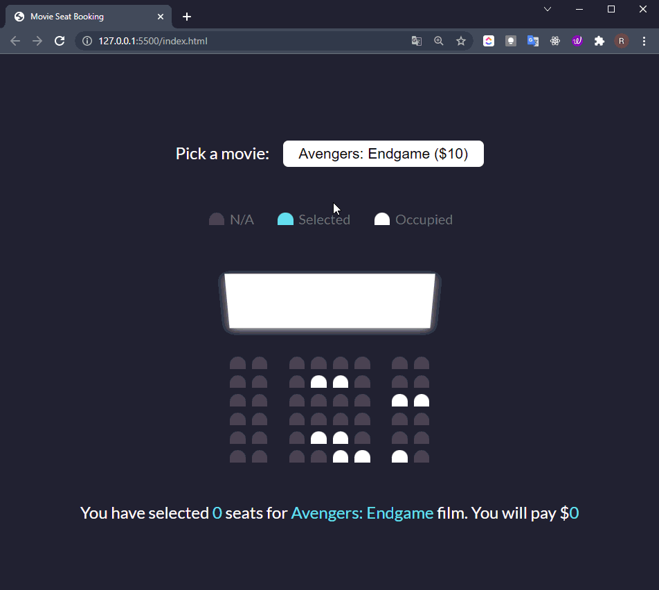

<h1 align="center">Movie-Seat-App</h1>

 ⌛ Happy Coding  ✍ 

# 
<!-- Please update value in the {}  --> 

  

  

  

  

<!-- TABLE OF CONTENTS --> 

 ## `Table of Contents` 

  

- [Overview](#overview) 

- [Built With](#built-with) 

- [Features](#features) 

- [How to use](#how-to-use) 

- [Acknowledgements](#acknowledgements) 

- [Contact](#contact) 

  

<!-- OVERVIEW --> 
## `Movie Seat Booking`

Display movie choices and seats in a theater to select from in order to purchase tickets

##  `Project Specifications` 

- Display UI with movie select, screen, seats, legend & seat info
- User can select a movie/price
- User can select/deselect seats
- User can not select occupied seats
- Number of seats and price will update
- Save seats, movie and price to local storage so that UI is still populated on refresh

 ## `Overview` 

-Problem Statement
- Design a page following the design in.

 ## `Built With` 

 

<!-- This section should list any major frameworks that you built your project using. Here are a few examples.--> 

  

##  `How To Use` 

  

<!-- This is an example, please update according to your application --> 

  

To clone and run this application, you'll need [Git](https://git-scm.com)  

##  `Acknowledgements` 

- Information for your projects 

  
 

- This is <a href="http://www.fuatsevinc.com" target="_blank">My Portfolio Website</a>
